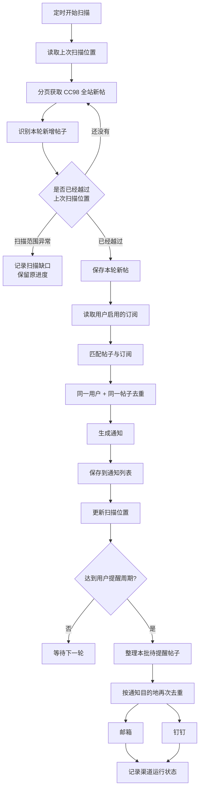

# CC98 AI+

> 面向浙江大学 CC98 论坛的 AI 搜索与新帖订阅工具
> 当前状态：Internal Beta

CC98 每天都在产生新的讨论，也沉淀了大量有价值的历史内容。我们希望让用户更容易从这条不断延伸的信息流中找到自己真正关心的部分。

CC98 AI+ 因此沿着两个方向工作：

* **AI Search 向后看**：从已经发生的讨论中搜索、阅读并整理信息，帮助用户找到过去留下的答案。
* **Watch 向前看**：持续关注正在出现的新讨论，在感兴趣的内容出现时及时提醒用户。

一个帮助用户重新发现已经存在的信息，一个帮助用户减少对未来信息的错过。它们共同解决的是同一个问题：**让 CC98 上真正有价值的信息，在需要的时候更容易抵达用户。**

两个功能在产品体验上相互呼应，在技术架构上保持独立。AI Search 主要运行在浏览器侧，Watch 则由后端持续工作，由此形成不同的数据边界与安全设计。

---

## 项目亮点

### AI Search：搜索留在浏览器

AI Search 直接运行在浏览器扩展中。

用户自己的 CC98 登录状态用于访问 CC98，用户自己的 LLM API Key 用于生成搜索词和总结。搜索过程、问题和结果主要保留在浏览器侧。

这意味着：

* 用户的 CC98 Token 无需上传到我们的服务器；
* 用户的 LLM API Key 无需上传到我们的服务器；
* AI Search 可以直接使用用户当前能够访问的 CC98 内容；
* 后端无需代理用户进行历史搜索。

我们希望从产品架构开始缩小敏感数据需要经过的范围。

---

### Watch：持续关注你真正关心的新帖

用户可以创建若干条订阅表达式，例如：

```text
C++ 后端/服务端 实习
```

其中：

* 空格表示同时满足；
* `/` 表示满足其中一个。

Watch 后端会持续扫描 CC98 的全站新帖，并判断新帖子是否符合用户的订阅。

命中的帖子会首先进入 CC98 AI+ 的通知列表。用户还可以选择邮箱、钉钉等外部提醒渠道。

因此，即使用户没有一直打开 CC98，也可以持续关注：

* 实习与招聘；
* 课程与考试信息；
* 校园活动；
* 出物、求购与拼车；
* 某个长期关注的话题。

---

### 多层去重

新帖扫描和通知并不是简单地“看到一次，发送一次”。

在真实运行过程中，同一个帖子可能因为分页变化、重复扫描、多条订阅同时命中、多个账号共享通知目的地等原因再次出现。

CC98 AI+ 在多个阶段进行去重：

| 阶段   | 处理目标                      |
| ---- | ------------------------- |
| 新帖扫描 | 避免同一轮扫描中重复处理同一帖子          |
| 帖子记录 | 同一个 CC98 Topic 只保留一份记录    |
| 订阅匹配 | 同一用户的多条订阅命中同一帖子时只生成一次结果   |
| 通知记录 | 同一用户对同一帖子最多拥有一条通知         |
| 外部提醒 | 同一轮中，相同邮箱或钉钉目的地不会重复收到同一帖子 |

最终用户看到的是“这篇帖子与你有关”，而不会因为它同时命中了多条订阅收到多份相同提醒。

---

### 增量扫描与缺口保护

Watch 会记录已经处理到的位置，并在下一轮继续向前扫描。

正常情况下，每一轮只处理上次扫描之后出现的新帖子。

同时，我们也考虑了扫描间隔内新帖数量突然增加、网络失败、分页变化等情况。如果系统无法确认已经完整追上上一轮的位置，会记录扫描异常，并保留原有进度。

这样可以避免在扫描不完整的情况下直接跳过一段帖子。

---

### 消息中心与外部提醒

CC98 AI+ 将“匹配到什么”和“提醒是否成功送达”分开处理。

一篇帖子只要成功匹配，就会进入用户的通知列表。

邮箱和钉钉负责提供额外提醒。到达用户设定的提醒周期后，当前积累的匹配结果会批量发送到已经启用的渠道。

外部渠道采用 **at-most-once** 的投递方式：

* 每批提醒最多尝试一次；
* 发送失败不会持续自动重试；
* 某个渠道故障不会让失败任务不断积压；
* 原始匹配结果仍然可以在通知列表中查看。

这种设计让通知列表承担稳定的消息记录职责，同时让邮箱和钉钉保持轻量。

---

## Watch 如何工作



从用户视角来看，一条新帖大致经历：

```text
出现在 CC98
    ↓
被 Watch 扫描到
    ↓
与订阅进行匹配
    ↓
进入通知列表
    ↓
到达提醒时间
    ↓
发送到启用的外部渠道
```

其中任何扫描重复、订阅重叠和通知目的地重叠，都会在对应阶段被处理。

---

## Security & Privacy

我们尽量让敏感信息只存在于真正需要它的位置。

| 数据                 | 保存位置  | 是否上传产品后端         |
| ------------------ | ----- | ---------------- |
| 用户 CC98 Token      | 浏览器   | 否                |
| 用户 LLM API Key     | 浏览器   | 否                |
| AI Search 问题与结果    | 浏览器   | 否                |
| CC98 AI+ 登录状态      | 浏览器   | 调用 Watch API 时携带 |
| 用户订阅               | 后端数据库 | 是                |
| 通知历史               | 后端数据库 | 是                |
| 邮箱 / 钉钉通知配置        | 后端数据库 | 是                |

此外，当前后端还包含以下安全措施：

* 仅允许指定的浙江大学邮箱域名完成产品登录；
* 邮箱验证码不会以明文形式长期保存在数据库中；
* 验证码具有有效期和错误尝试次数限制；
* 用户接口根据登录状态识别当前用户，不接受客户端自行指定其他 `user_id`；
* 管理接口使用独立的管理员认证；
* 邮箱、Webhook、Secret 等敏感通知配置在正常接口响应和错误信息中进行脱敏；
* 生产环境可以关闭公开 API 文档并限制允许访问后端的前端来源。

安全设计仍会随着内测继续完善，当前已知限制见下文。

---

## Know-how

### AI Search 为什么放在浏览器侧？

AI Search 需要用户自己的 CC98 Token 和 LLM API Key。

因此搜索链路直接在浏览器中完成，让后端无需接触这两类敏感凭据，也让 AI Search 与 Watch 保持解耦。

### 为什么一个用户对一个帖子只保留一条通知？

同一篇帖子可能同时命中多条订阅。

Watch 最终以：

```text id="u4d3pk"
user_id + topic_id
```

作为通知唯一关系。

订阅负责发现帖子，通知表达“这篇帖子值得这个用户关注”。

### 为什么采用 at-most-once 外部投递？

邮件和 Webhook 可能因超时、配置失效或平台限制而失败。

Watch 对每批外部提醒最多尝试一次，失败后不自动补发，避免长期失效的渠道不断积压任务或重复推送旧消息。

### 匹配结果与消息送达是两个问题

Watch 会先保存匹配结果，再处理邮箱、钉钉等外部提醒。

因此系统可以分别判断：

* 是否发现了用户关心的帖子；
* 是否成功通过外部渠道提醒了用户。

即使外部通知失败，匹配结果仍会保留在通知历史中。

---

## 技术文档

README 主要介绍产品设计和核心工作方式。

更完整的实现、接口和运行说明可以查看：

* [`docs/technical-documentation.md`](docs/technical-documentation.md) — 当前系统技术文档
* [`docs/interfaces.md`](docs/interfaces.md) — 后端接口说明
* [`docs/2026-09-02-scan-notification-redesign.md`](docs/2026-09-02-scan-notification-redesign.md) — Watch 扫描与通知机制的重构记录

日期化文档主要用于保留历史设计过程，当前实现以技术文档和代码为准。

---

## Known Limitations

CC98 AI+ 当前仍处于内测阶段，一些设计还有继续完善的空间。

目前主要包括：

* 后端调度目前按单进程、单服务实例设计；
* 通知渠道中的部分 Secret 当前仍由后端数据库保存，尚未实现完整的静态加密方案；
* 产品登录 Token 当前缺少服务端主动撤销机制；
* 邮箱验证码仍需要进一步完善应用层的发送频率限制；
* 邮箱和钉钉采用 at-most-once 投递，极端情况下可能出现外部提醒漏发；
* 通知历史目前缺少长期归档与自动清理策略。

这些限制会随着内测反馈逐步调整。

---

## Current Status

项目已经完成第一阶段开发并进入内部测试。

目前可以完整运行：

```text
浙江大学邮箱登录
        ↓
创建 / 暂停 / 删除订阅
        ↓
后端持续扫描 CC98 新帖
        ↓
匹配用户订阅
        ↓
保存通知历史
        ↓
邮箱 / 钉钉提醒
```

AI Search 与 Watch 已经形成相互独立的两条功能链路。

接下来我们会继续关注实际使用中的搜索体验、订阅匹配质量、通知可靠性和隐私安全。
